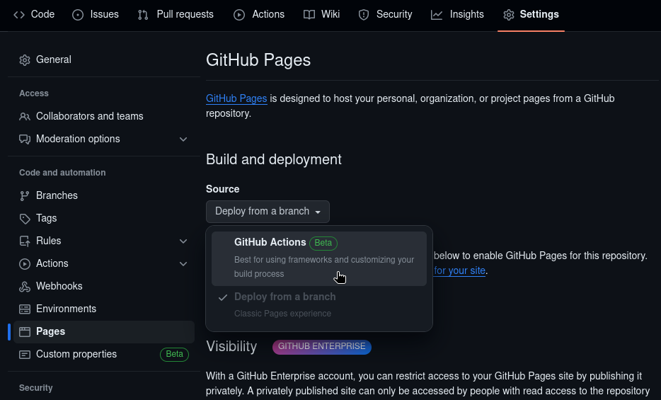

# Root Certificate Authority (CA)

This will guide you through setting up and operating your own Root CA based on a
YubiKey and distributing the CA files through Github Pages.

I've explored two options for storing CA and YubiKey secrets:

1. Block Device (USB)
2. KeePassXC Database (kdbx file)

Originally I used the block/USB storage option, but found it too limiting due to
only being able to be mounted on Linux systems with `cryptsetup` (LUKS)
installed. I also found this option to be tedious as I needed to partition and
encrypt duplicate USB devices to have safe backups, as well as manually sync
each device.

Now, I've settled on using the KeePassXC CLI tool to store a backup of the Root
CA private key and YubiKey secrets in an encrypted database. This gives me the
ability to backup the database anywhere, including private Cloud storage. While
Linux is required to setup the CA this way, it is not required to perform
emergency CA operations, such as revoking certificates or the root itself. This
can be done on any system with OpenSSL installed, including Windows.

!!! note
    While it is possible, using a Windows environment for day-to-day operation
    is **not** recommended as there are a lot of moving parts that make doing
    things securely much more challenging. This guide uses the Linux Kernel Key
    Retention Service and a temporary keyring to store the YubiKey PIN while
    performing CA operations.

    Doing something similiar is possible on Windows using the Credential
    Manager, but would require third-party Powershell modules and manually
    clearing the PIN from the Credential Manager when finished. This is
    acceptable (in my opinion) in an emergency (such as revoking the CA
    certificate if the private key is exposed), but should should otherwise be
    avoided.

## Preparation

Before we can create the Root CA, we'll need to prepare the environment that the
certificate and Certificate Revocation List (CRL) will be published to.

To accomplish this, we'll be leveraging Github Pages and a Github App (bot). The
Github App will be responsible for creating a new branch on the target
repository, uploading the files to this branch, and creating a Pull Request to
merge the files in the branch that will be built by Github Pages and published.

### Domain DNS

The first thing you'll need is a domain. This isn't strictly necessary as you
can just set the Authority Information Access (AIA) and CRL Distribution Point
(CDP) URLs to
`http://[username/organization].github.io/[repository]/[certificate].crt` and
`http://[username/organization].github.io/[repository]/[certificate].crl`
respectively, but where's the fun in that.

For general instructions on how to configure your DNS settings, refer to the
Github documentation page
[Managing a custom domain for your Github Pages site](https://docs.github.com/en/pages/configuring-a-custom-domain-for-your-github-pages-site/managing-a-custom-domain-for-your-github-pages-site).

Personally, I use [Cloudflare](https://www.cloudflare.com/) to serve DNS for my
domain, `doubleu.codes`. If you do as well, then keep in mind that when you
create the `CNAME` record, be sure to set the record to be `DNS only` so that it
is not proxied by Cloudflare.


This is done because when Cloudflare proxies traffic to the resource, they add a
[Let's Encrypt](https://letsencrypt.org/) certificate and enforce HTTPS. Some
PKI frameworks (namely Windows' `CryptoAPI`) will fail if either the AIA or CDP
resources are served through an HTTPS connection. This is due to strict
adherence to [RFC 5280](https://datatracker.ietf.org/doc/html/rfc5280), which
mandates that both AIA and CDP resources `MUST` be accessible from HTTP. This is
not a problem since the certificate and CRL are cryptographically signed and
verifiable independent of the transport methodology.

### Create the Repository

Create a new Github repository. Be sure that it is `Public` and to initialize
the repository with a `README` file by checking `Add a README file`. This will
create the default `master` branch (yours may be `main` of that's your
preference).

### Configure Github Pages

In the repository settings, navigate to `Code and automation`, then click
`Pages`. Next, select the `Source` dropdown and click `Github Actions`.



On the `Code` tab, click the `Add file`/`+` dropdown and then click `Create new
file`. The name of the file should be `.github/workflows/pages.yaml`. This file
is also located in the `bootstrap` repository at
`$LABBOOTSTRAPPATH/root-ca/pages.yaml`.

```yaml title=".github/workflows/pages.yaml" linenums="1"
--8<-- "https://raw.githubusercontent.com/doubleu-labs/bootstrap/master/root-ca/pages.yaml"
```

Click `Commit changes...` and optionally add a message.

If you're using your own domain as part of the AIA and CDP URLs, then create
another file named `CNAME`. This will configure Github Pages to serve the Page
from your subdomain. The file contents should contain a single line with the
domain. If you aren't using your own domain to serve these files, then you can
skip this.

```txt title="CNAME"
ca.doubleu.codes
```

Click `Commit changes...` and optionally add a message.

### Github App

In the top right, click your profile image, then `Settings` to go to your
accout settings. In the left column, click `Developer settings`. Under `Github
Apps`, on the top right click `New Github App`.

Create the name for your App. Also provide a `Homepage URL`. This is required,
but it can point to anything.

Scroll down to `Webhook` and uncheck `Active`. This will make the `Webhook URL`
no longer required to create the App.

Scroll down to `Permissions`. Under `Repository permissions`, set `Metadata` to
`Read-only` and `Pull requests` to `Read and write`.


At the bottom, decide where the App can be installed. If the CA repository is on
your personal account, then either option is viable. If your CA repository is on
and Organization account, then the App must be set to `Any account`, making it a
public App.

Now click `Create Github App`. You will then be take to the settings page for
the new App.

Near the bottom of the settings page, you'll find the `Private keys` section.
You can click the `Generate a private key` button now, or later when you
provision your YubiKey. If you generate one now, remember that it will be saved
to your browser's default `Downloads` directory.

Next, in the column on the left, click `Install App` and click `Install` next to
the account that owns the CA repository. You can select `All repositories` or 
`Only select repositories`, though I recommend the later option. If you select
`Only select repositories`, select the CA repository from the dropdown. Then
click `Install`.

Preparations are now complete and we're ready to initialize your Root CA.

## Choose Storage Method

You'll have to choose which storage method you want in order to proceed. We'll
cover the pros and cons again real quick:

- Block Device
    - Pros:
        - Usable without additional software on Linux
    - Cons:
        - Only usable on Linux
        - Can only be physical devices
        - Duplicate devices must be kept for safe backups
        - Duplicate devices must be managed manually
        - Files are exposed when the device(s) are mounted
- KeePassXC Database (KDBX)
    - Pros:
        - Usable on any system where KeePassXC runs
        - Can be stored anywhere
        - Only one file to store everyting
    - Cons:
        - Requires third-party software to use
        - Requires Linux Kernel Key Retention Service to use securely, otherwise
            secrets could be potentially leaked in plaintext

Once you've decided which way you want to go, skip to the relevant section:

[Storage - Block Device](./block.md)

[Storage - KDBX Database](./kdbx.md)
