# Prepare to Go Offline

The general plan once the current network goes offline is to:

1. Configure iDRACs to use DHCP
2. Deploy OOBM `srv` node (dnsmasq)
3. Configure switches
4. Install and Confiigure OPNSense firewall
5. Install CritiCluster nodes
6. Configure cluster networking
7. Deploy temporary DNS services

All of my iDRAC interfaces have Enterprise licenses, so I will use the HTML5
IP-KVM functionality to install those server's operating systems. If you do not
have Enterprise licenses on yours, then you will need USB drives to flash
install media and a keyboard and monitor to complete OS installations the
old-fashioned way.

Once these steps are complete, we'll have enough internet access to install the
rest of the critical services normally. But there's a few things we need to take
download and prepare before we can take the existing network offline and start
this process.

## Download OPNsense Installation Media

Navigate to [https://opnsense.org/download/](https://opnsense.org/download/) and
select the DVD image. This will give us a `iso.bz2` file, which will need to be
uncompressed. We'll use `bzcat` to stream the output to `stdout`, which we'll
redirect to a file in the `bootstrap` repo path:

```sh
bzcat ~/Downloads/OPNsense-*-dvd-amd64.iso.bz2 \
> $LABBOOTSTRAPPATH/.download/OPNsense.iso
```

## Download Fedora CoreOS

Next, we need to download the bare-metal ARM64 image for Fedora CoreOS. 

```sh
coreos-installer download \
-a aarch64 \
-s stable \
-C $LABBOOTSTRAPPATH/fcos/
```

## Download K3s Selinux Package

```sh
dnf download \
--repofrompath=rancher,https://rpm.rancher.io/k3s/stable/common/coreos/noarch \
--repo=rancher \
--destdir=$LABBOOTSTRAPPATH/k3s/packages \
k3s-selinux
```

Now we need to rename the `k3s-selinux` RPM file because it's linked in the
CoreOS Butane manifests as `k3s-selinux.rpm`:

```sh
mv $LABBOOTSTRAPPATH/k3s/packages/k3s-selinux*.rpm \
$LABBOOTSTRAPPATH/k3s/packages/k3s-selinux.rpm
```

## Download K3s Airgap Images

```sh
curl -LO --output-dir $LABBOOTSTRAPPATH/k3s/system \
https://github.com/k3s-io/k3s/releases/latest/download/k3s-airgap-images-arm64.tar.zst
```

```sh
curl -Lo $LABBOOTSTRAPPATH/k3s/system/k3s \
https://github.com/k3s-io/k3s/releases/latest/download/k3s-arm64
```

```sh
curl -Lo $LABBOOTSTRAPPATH/k3s/system/install.sh https://get.k3s.io/
```

## Download Raspberry Pi U-Boot Images

```sh
dnf download \
--repo=fedora \
--forcearch=aarch64 \
--destdir=$LABBOOTSTRAPPATH/raspberry-pi/uboot/rpm \
bcm2711-firmware \
bcm283x-firmware \
bcm283x-overlays \
uboot-images-armv8
```

## Download K3s Application Images 

Since we're leveraging K3s' built-in Helm controller, we'll use Helm to download
a copy of the MetalLB chart, and parse the rendered manifests using `yq` for the
tags of the images it expects to be on the system:

```sh
helm repo add metallb https://metallb.github.io/metallb
```

```sh
helm repo update
```

```sh
helm pull metallb/metallb -d $LABBOOTSTRAPPATH/k3s/init
```

```sh
helm template metallb/metallb | \
yq --no-doc '.. | .image? | select (.)' | \
sort -u >> $LABBOOTSTRAPPATH/k3s/init/metallb-images.txt
```

```sh
podman pull --arch=aarch64 \
$(cat $LABBOOTSTRAPPATH/k3s/init/metallb-images.txt)
```

```sh
podman save -m $(cat $LABBOOTSTRAPPATH/k3s/init/metallb-images.txt) | \
zstd -o $LABBOOTSTRAPPATH/k3s/init/metallb-images.tar.zst
```

## Download OOBM Control Node Application Images

We're going to use an additional Raspberry Pi to run `dnsmasq` that will serve
DNS, DHCP and TFTP services for the Out-of-Band Management network. This will
allow us to assign addresses to all OOBM devices and make configuration scripts
for the switches available over TFTP. The Pi will run Fedora CoreOS, so
configuration changes can be done by simply reflashing the OS with the new files
included.

The plan is to eventually replace this node with something that has two network
interfaces so that it can act as a jump or bastion host for the OOBM network.
For now, it will be completely isolated and headless.

```sh
podman pull ghcr.io/doubleu-labs/dnsmasq:latest
```

```sh
podman save ghcr.io/doubleu-labs/dnsmasq:latest \
> $LABBOOTSTRAPPATH/fcos/oobm-srv/dnsmasq.tar

```

## Gather OOBM Facts

Gather the MAC addresses for all of the iDRAC interfaces and switches.

### PowerConnect 6248

Enter the following to show the MAC address of the switch:

```{ .raw .no-copy }
console> enable
```

```{ .raw .no-copy }
console# show ip interface management
```

```{ .raw hl_lines="7" .no-copy }
IP Address.............................. 0.0.0.0
Subnet Mask............................. 0.0.0.0
Default Gateway......................... 0.0.0.0
IPv6 Administrative Mode................ Enabled
IPv6 Prefix is.......................... FE80::FAB1:56FF:FE33:4E64/64
IPv6 Gateway............................ none
Burned In MAC Address................... F8B1.5633.4E64
Configured IPv4 Protocol................ None
Configured IPv6 Protocol................ None
IPv6 AutoConfig Mode.................... Disabled
Managment VLAN ID....................... 1
```

### PowerSwitch S4810

```{ .raw .no-copy }
console> enable
```

```{ .raw .no-copy }
console# show interfaces ManagementEthernet 0/0 | grep "Current address"
```

```{ .raw .no-copy }
    Current address is 00:01:e8:8b:4b:dc
```

!!! note
    The command `show system brief` displays the _stack_ MAC address, which is
    different than the `ManagementEthernet` MAC address. The later is what you
    will need to configure the static allocation on the DHCP server.

### iDRAC Interfaces

Boot each server with a monitor and keyboard and perform the following steps on
each.

On the BIOS screen, press `F2` to enter the setup menu.

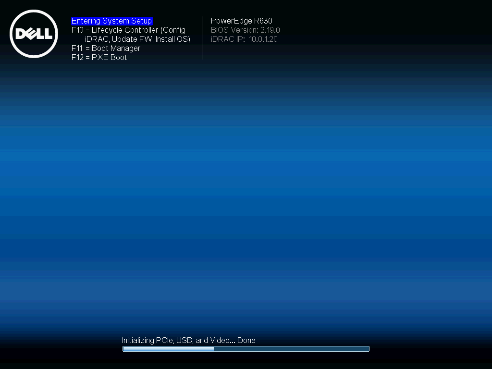

Navigate down to `iDRAC Settings` and enter it:

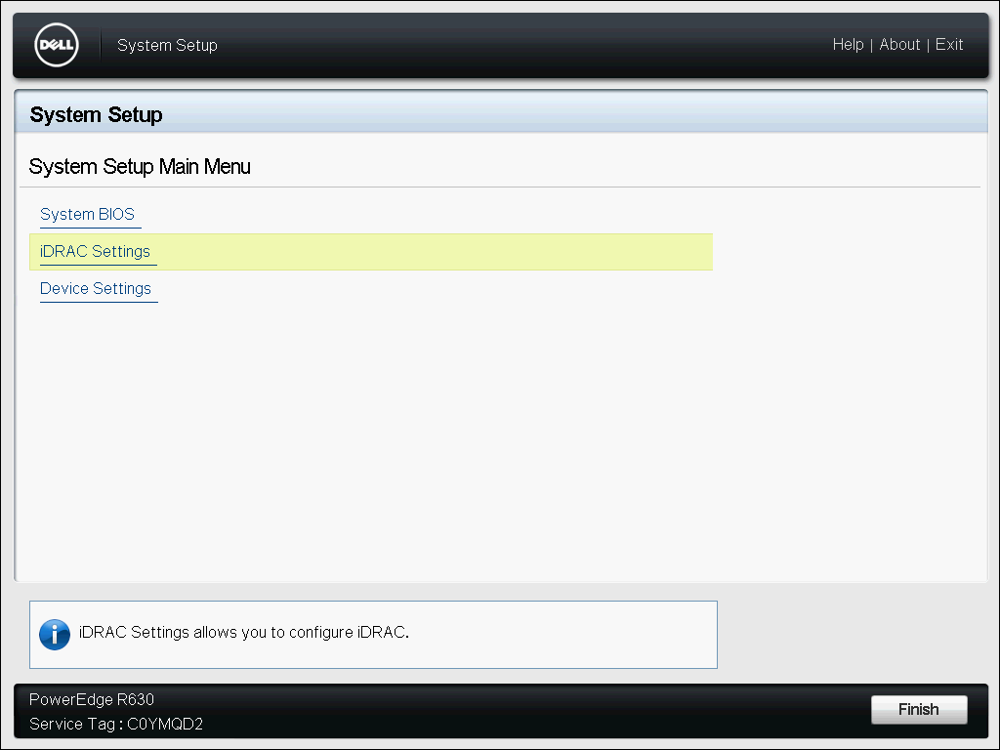

Navigate down to `Network` and enter that section:

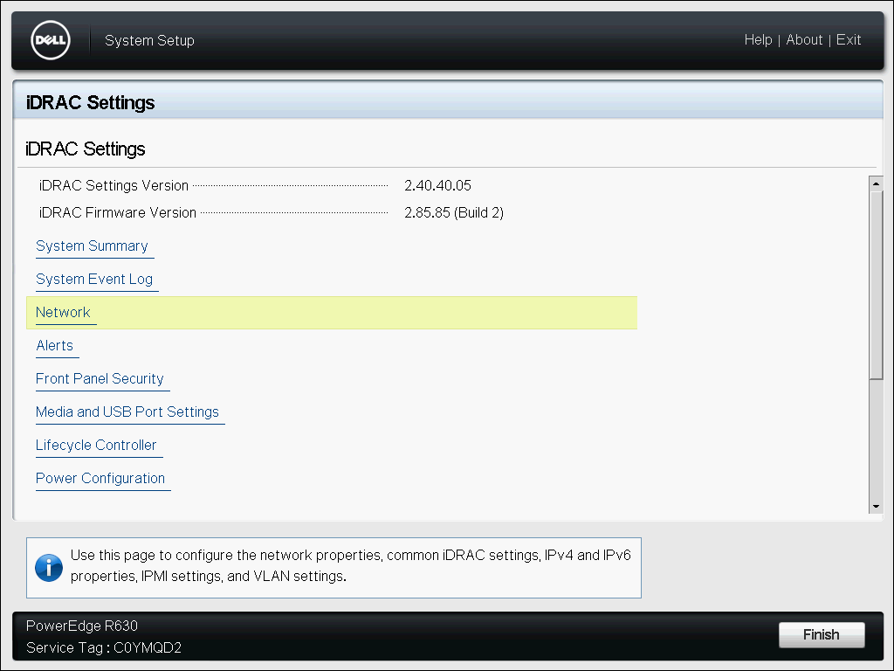

Take note of the MAC Address here:

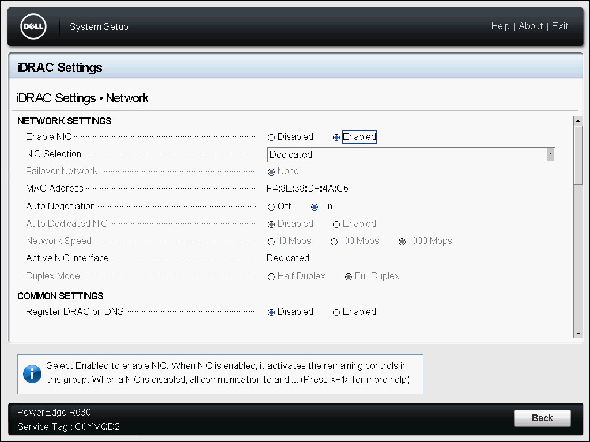

Now navigate down to the Common and IPv4 settings.

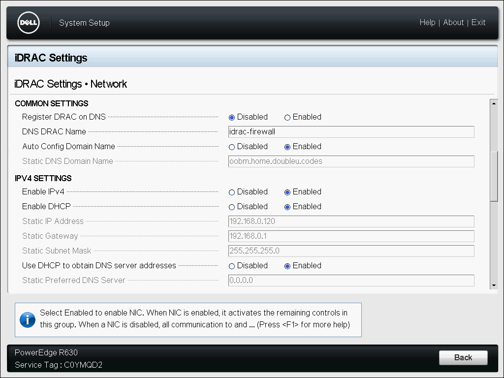

1. Set the `DNS DRAC Name`. This will be allow the iDRAC to be accessed by the
    domain name. Without setting the DNS name, you will get an `Unauthorized`
    error when you attempt to load the portal, leaving the IP address the only
    way to access it.
2. Enable `AutoConfig Domain Name`.
3. Ensure that `Enable IPv4` is `Enabled`
4. Set `Enable DHCP` to `Enabled`
5. Set `Use DHCP to obtain DNS server addresses` to `Enabled`

When you exit the iDRAC settings menu, be sure to save the settings:

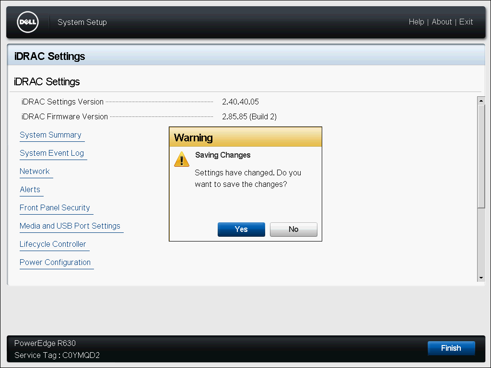

#### (Optional) Set System to UEFI

Optionally, you can switch the servers from `BIOS` mode to `UEFI`.

On the system settings menu, select the `System BIOS` section and enter it:

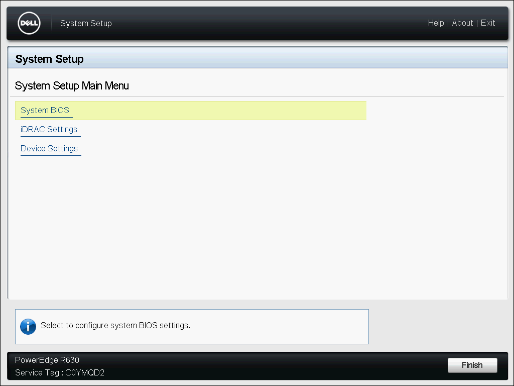

Navigate down to `Boot Settings` and enter it:

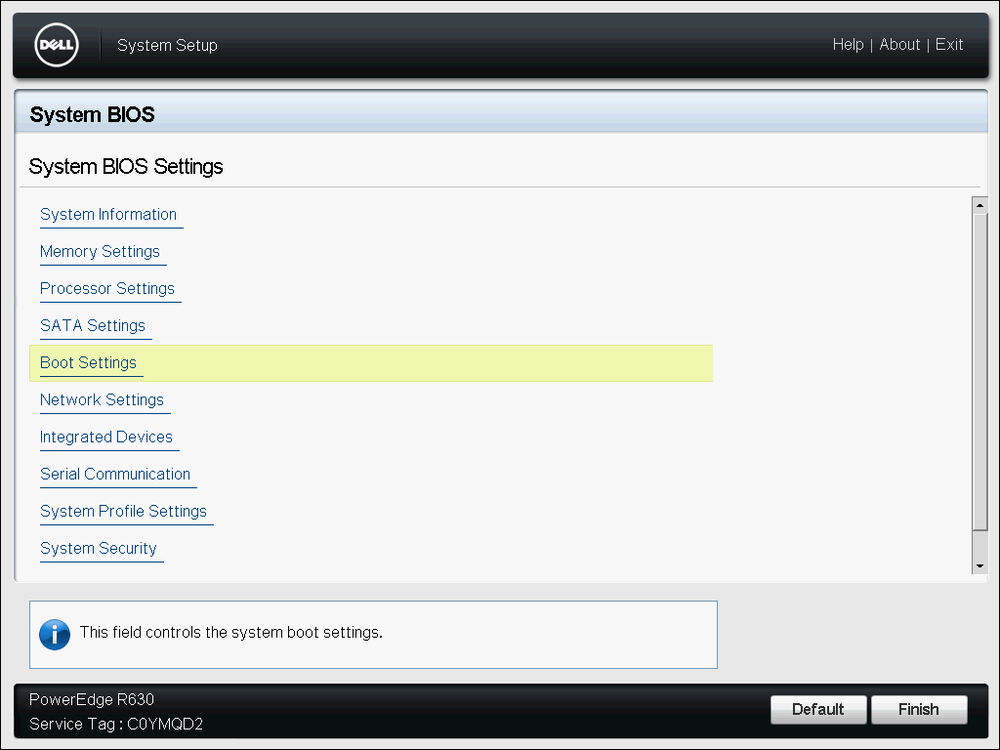

Toggle `Boot Mode` from `BIOS` to `UEFI`:

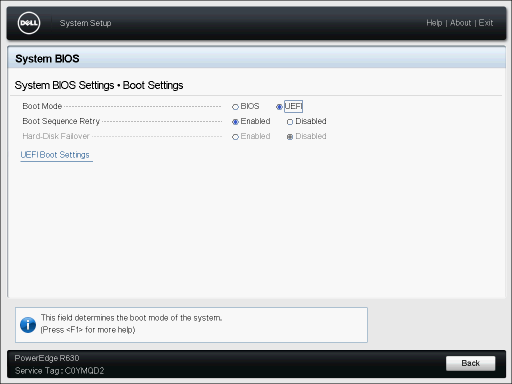

Back out until you are prompted to save the changes.

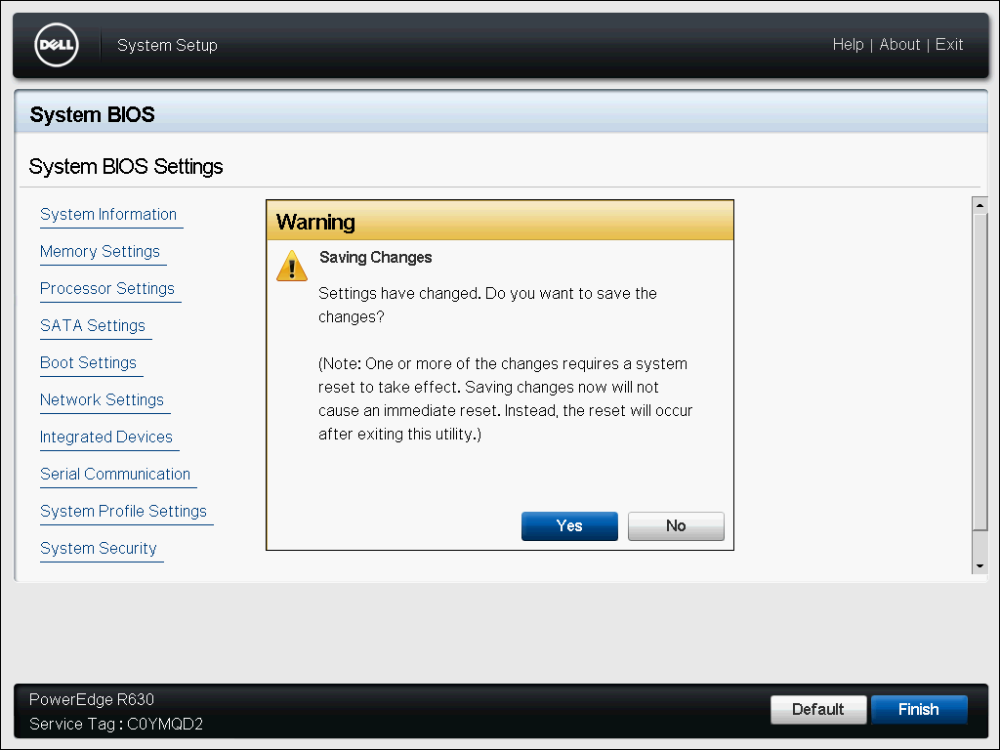

Hit the `Finish` button at the bottom. You will be promted that the server will
now reboot. Hit `Yes`:

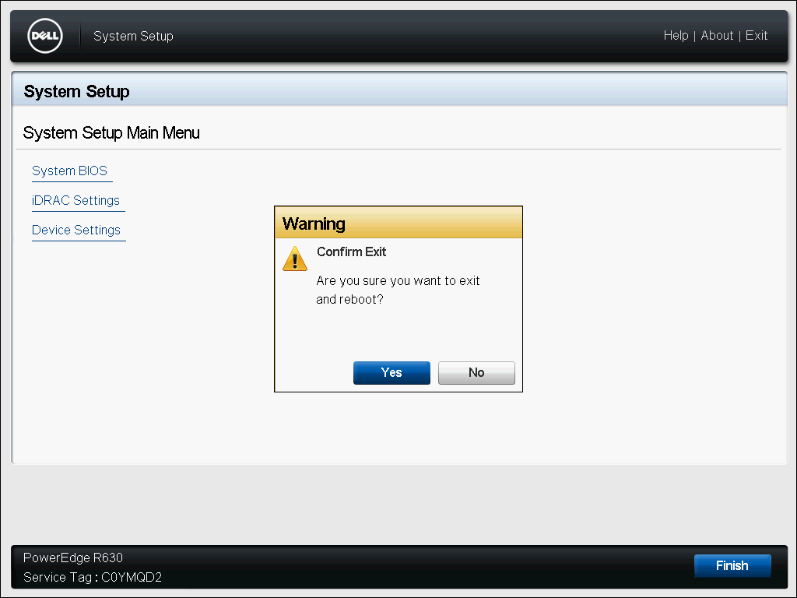
