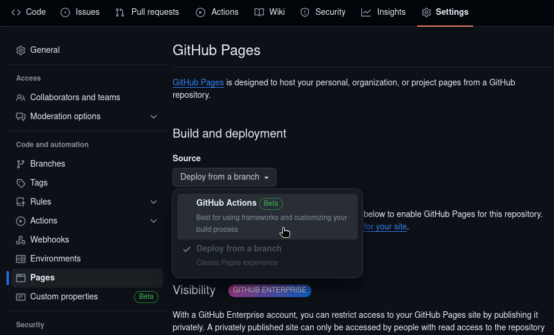
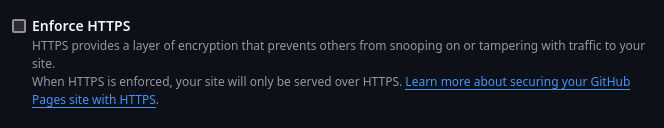
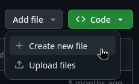
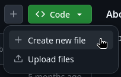

# Clone the CA Template

The repository template we'll be cloning is located
[here](https://github.com/doubleu-labs/ca-template){:target="\_blank"}.

For your convenience, the below button will open the `New Repository` page with
the template automatically selected.

[](https://github.com/new?template_name=ca-template&template_owner=doubleu-labs){:target="\_blank"}

You'll notice that immediately, the included Action Workflow will run and fail.
This is due to Pages being configured to deploy from a branch by default instead
of Github Actions. This is fine, we'll fix that next.

## Configure Settings

In the repository settings, navigate to `Code and automation`, then click
`Pages`. Next, select the `Source` drop-down and click `Github Actions`.



Ensure that `Enfore HTTPS` is disabled.



!!! note 
    [RFC 5280](https://datatracker.ietf.org/doc/html/rfc5280){target="\_blank"}
    defines the X.509 standard and how assets are to be distributed.

    - [&#167; 4.2.1.13](https://datatracker.ietf.org/doc/html/rfc5280#section-4.2.1.13){target="\_blank"} -
    CRL Distribution Points (CDP)
    - [&#167; 4.2.2.1](https://datatracker.ietf.org/doc/html/rfc5280#section-4.2.2.1){target="\_blank"} -
    Authority Information Access (AIA)

    Both AIA certificate and CDP CRL ***MUST*** be DER encoded and accessible
    from unencrypted HTTP requests. Some PKI implementations (notably Windows'
    `CryptoAPI`) strictly adhere to the RFC and will fail if either of these
    extensions contain HTTPS URIs, though *most* applications will retrieve them
    either way.

    Not having encryption isn't an issue since certificates and CRLs are
    cryptographically signed and integrity can be verified independent of the
    transport methodology.

## (Optional) Add CNAME

If you're using a custom domain, create a file named `CNAME` in the root of the
repository.

The `Add file` button is above the list of files next to the green `Code`
button. If your browser window is narrow, then `Add file` will be replaced with
a `+` button. The function is the same.




The contents of the `CNAME` file should be the URL of your CA on a single line:

```txt title="CNAME"
ca.example.com
```

## Configure Workflow

You'll need to make sure to use the correct `cp` line for the `crt` and `crl`
files.

If your `crt` and `crl` files are in the root of the repository, then uncomment
line `23` as-is.

If you plan to use a subdirectory for your `crt` and `crl`, then uncomment line
`26` and replace `subdirectory` with the name of the directory.

If you're using a custom domain and have created the `CNAME` file, uncomment
line `29`.

```yaml title=".github/workflows/pages.yaml" linenums="1" hl_lines="23 26 29"
--8<-- "https://raw.githubusercontent.com/doubleu-labs/ca-template/refs/heads/master/.github/workflows/pages.yaml"
```

## Edit README

The contents of the README file should be completely replaced. This file will be
rendered by the Pages workflow into the `index.html` of the Pages site.

This could contain links to the `crt` and `crl` files, a description of your CA,
or whatever you want.

If you want to know what you can do with this file, check out the Action that's
used to render it:

[`wranders/markdown-to-pages-action`](https://github.com/wranders/markdown-to-pages-action){target="\_blank"}

## Edit LICENSE

The template repository is licensed under
[`MIT No Attribution`](https://github.com/doubleu-labs/ca-template/blob/master/LICENSE){target="\_blank"}. This was done so that anyone could use the template
and not be required to include a copy of the license or a give me credit in your
cloned repository. It also means you're free to license your CA in any way that
you see fit, including having no license, making your CA repository proprietary.

!!! note
    If you choose to not include a license and make your repository proprietary,
    do keep in mind that under the Github
    [Terms of Service](https://docs.github.com/en/site-policy/github-terms/github-terms-of-service#5-license-grant-to-other-users){target="\_blank"},
    if the repository is public, then **_anyone_** on the platform has the right
    to fork or clone your repository. They would, however, not have the right to
    make modifications of that copy.

    Read the legalese and know your rights.

## Next Step

[Create and Configure your Github App](../github_app/index.md)
