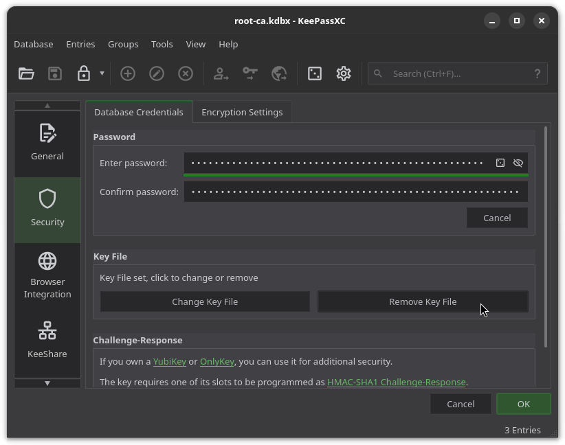

# Database Security

During the initialization process, two KeePassXC databases are created and store
the following information:

- `root-ca.kdbx`:
    - CA unencrypted private key, public key, CSR, and certificate
    - Github App unencrypted private key, and dummy certificate
    - YubiKey Managment Key, PIN, and PIN Unlock Key
- `yk-pin.kdbx`:
    - YubiKey PIN

Without modification, these databases are ***ONLY*** secured using a 1MB keyfile
with the same name as the database and in the same directory.

Since these databases contain the most sensitive data regarding the new Root CA
(particularly `root-ca.kdbx`), the security settings of each database
***MUST*** be changed. But, each database should have vastly different security
goals.

The security goal of `root-ca.kdbx` is to be extremely difficult to crack, but
just accessible enough to be able to perform disaster recovery if needed.

The security goal of `yk-pin.kdbx` is to be difficult to crack, but secure and accessible to perform CA operations by anyone that knows the password.
This is effectively no different than if you just had an encrypted private key,
but this method does not risk exposing the CA private key.

## Open Database(s)

Open the KeePassXC GUI application and click the `Open Database` button. This
will open your file explorer. Go to the directory you cloned `ca-bootstrap` to,
then to the `kdbx` directory. Choose the file with the `.kdbx` extension:


Under the password box, click the `I have a key file` link. This will open your
file explorer. Go to the directory you cloned `ca-bootstrap` to, then to the
`kdbx` directory. Choose the file with the `.key` file extension that has the
same name as the database you're trying to open:


Click the `Unlock` button:


## Modify Credentials

To modify the credentials and encryption settings, go to the `Database` menu,
then select `Database Security...`:


In the `Database Credentials` tab, click the `Add Password` button:


A pair of password boxes for the password and confirmation will appear.

For the `root-ca.kdbx` database, you should set a 12+ word passphrase.

For the `yk-pin.kdbx` database, you should configure it with a memorable
password or passphrase.

If you want to use a randomly-generated passphrase, on the right end of the
`Enter password` box, click the dice icon to open the password/passphrase
generator:


Click the `Passphrase` tab. Use the slider or the number box to select how many
words the passphrase should contain.

Next to the text box containing the passphrase, click the circle arrow a few
times to genereate a passphrase. Open an empty text editor to the side. Once
that is ready, click the clipboard icon next to the circle arrow to copy the
passphrase to the clipboard. Paste it into the text editor. You'll only have a
few seconds to do this before KeePassXC clears the clipboard.

!!! note
    The text editor containing the passphrase is only used so that you have the
    time and ability to format the text in a way that makes it easier to copy to
    some other medium, such as writing it down.

Once you have the passphrase securly copied, click the `Apply Password` button.


Back on the `Database Credentials` tab, click `Remove Key File`:



## Modify Encryption

Click the `Encryption Settings` tab:


Click the dropdown box next to `Database format` and select `KDBX 4`:


Click the dropdown box next to `Key Derivation Function` and select `Argon2id`:


Now for parameter selection, here's some generalized recommendations for each
database. Again, you're free to do whatever you want here:

- `root-ca.kdbx`:
    - `Transform rounds`: 25+
    - `Memory Usage`: 2048 MiB+
    - `Parallelism`: 4
- `yk-pin.kdbx`:
    - `Transform rounds`: 50+
    - `Memory Usage`: 256 MiB+
    - `Parallelism`: # CPU Cores

!!! note
    Parallelism of `4` for the `root-ca.kdbx` database was chosen to make
    decryption a little easier in the case that you have to revoke a certificate
    and all you have access to is something like a Raspberry Pi.

Modify `Transform rounds`, `Memory Usage`, and `Parallelism`:


Click the `Ok` button to apply Credential and Encryption settings.

This could take some time based on your chosen parameters. There will be two
re-encryption cycles when you click `Ok`: the first when the button is clicked,
and the second when the settings menu closes. Each cycle is re-encrypting a
different portion of the database file.

## Cleanup

Close the database by clicking the `Database` menu and then clicking
`Close Database`.


Repeat the above processes for the othe database if you haven't already.

Finally, remove the now unused keyfiles from the `kdbx` directory:

```sh
rm ./kdbx/*.key
```

## Next

Finally, we'll [deploy the assets and wrap up](../deploy_wrap_up.md).
