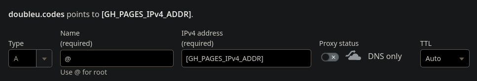
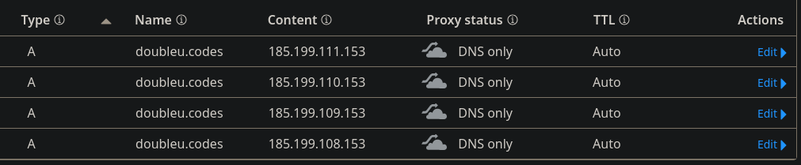
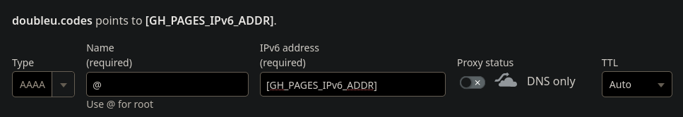
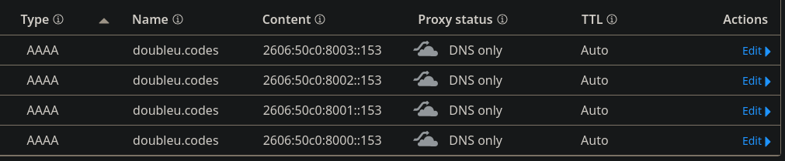
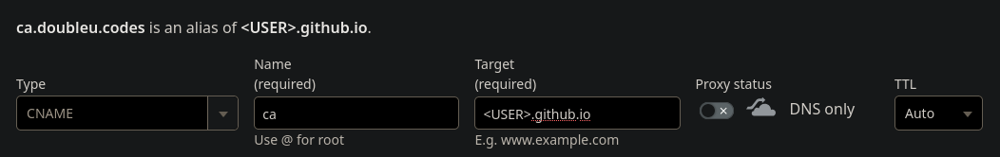
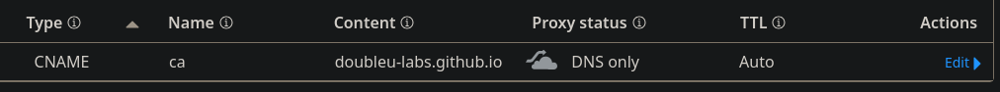

# (Optional) DNS

If you want to use your own domain to access your CA, then you'll need to set up
a DNS record with your provider.

[Check out the official documentation for more information.](https://docs.github.com/en/pages/configuring-a-custom-domain-for-your-github-pages-site/managing-a-custom-domain-for-your-github-pages-site#dns-records-for-your-custom-domain){target="\_blank"}

Personally, I use [Cloudflare](https://www.cloudflare.com/){target="\_blank"} to
serve DNS for my domain, `doubleu.codes`. So that's the provider that this
document will cover, but it should make no difference for other providers.

## Github Pages Records

The parent of the URL you will use will need to resolve to the Github Pages.

If you're using `ca.example.com`, then the root (`example.com` / `@`) of your
domain will need to point to Github Pages.

If you're using a nested subdomain, such as `ca.org.example.com`, then
`org.example.com` will need to point to Github Pages.

Be sure to set the `Proxy status` of each record to `DNS only`. This is done
because Github's Pages server IP addresses are public, and it prevents
Cloudflare from redirecting requests to HTTPS and injecting TLS certificates.

!!! note 
    [RFC 5280](https://datatracker.ietf.org/doc/html/rfc5280){target="\_blank"}
    defines the X.509 standard and how assets are to be distributed.

    - [&#167; 4.2.1.13](https://datatracker.ietf.org/doc/html/rfc5280#section-4.2.1.13){target="\_blank"} -
    CRL Distribution Points (CDP)
    - [&#167; 4.2.2.1](https://datatracker.ietf.org/doc/html/rfc5280#section-4.2.2.1){target="\_blank"} -
    Authority Information Access (AIA)

    Both AIA certificate and CDP CRL ***MUST*** be DER encoded and accessible
    from unencrypted HTTP requests. Some PKI implementations (notably Windows'
    `CryptoAPI`) strictly adhere to the RFC and will fail if either of these
    extensions contain HTTPS URIs, though *most* applications will retrieve them
    either way.

    Not having encryption isn't an issue since certificates and CRLs are
    cryptographically signed and integrity can be verified independent of the
    transport methodology.

### A

You'll need a set of `A` records that will resolve in a round-robin manner to
one of four Github hosts.

The following dialog is an example of creating the records to the Github Pages
hosts. You'll need to use each of the following addresses in the box populated
with `[GH_PAGES_IPv4_ADDR]`:

```text
185.199.108.153
```

```text
185.199.109.153
```

```text
185.199.110.153
```

```text
185.199.111.153
```



This is how the records are set for my domain, `doubleu.codes`:



### AAAA

If you want to support IPv6, you'll also need a set of `AAAA` records that will
also resolve in a round-robin manner to one of four Github hosts.

The following dialog is an example of creating the records to the Github Pages
hosts. You'll need to use each of the following addresses in the box populated
with `[GH_PAGES_IPv6_ADDR]`:

```text
2606:50c0:8000::153
```

```text
2606:50c0:8001::153
```

```text
2606:50c0:8002::153
```

```text
2606:50c0:8003::153
```



This is how the records are set for my domain, `doubleu.codes`:



### CNAME

Finally, you will need a `CNAME` record that points to `<USER>.github.io` or
`<ORGANIZATION>.github.io`. Names are relative to your domain root.

If you're using `ca.example.com`, then the `Name` field should be `ca`.

If you're using `ca.org.example.com`, the the `Name` field should be `ca.org`.

In any case, the target should be `<USER>.github.io` or
`<ORGANIZATION>.github.io`.



Since my Root CA is intended to cover my entire domain, I use a subdomain of the
root domain. This is how my `CNAME` record is set and would resolve
`ca.doubleu.codes`:



## Next

[Create the CA template.](../ca_template/index.md)
