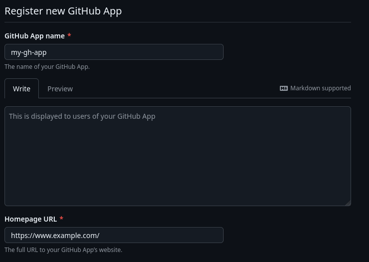
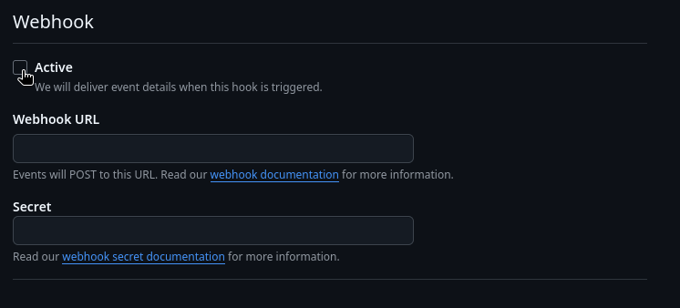
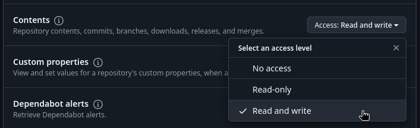
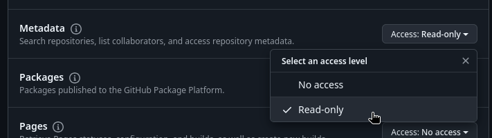
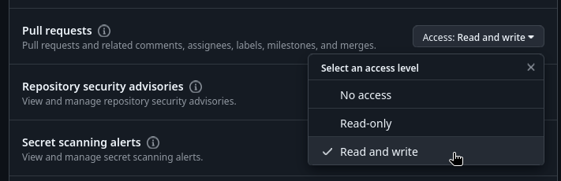
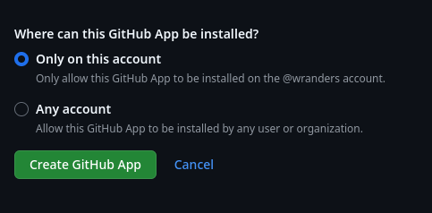
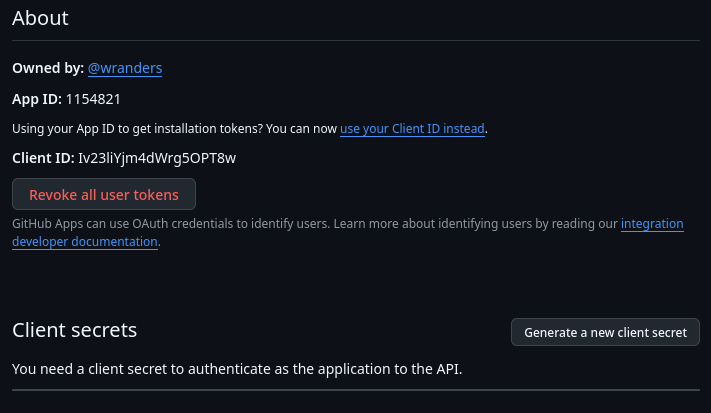
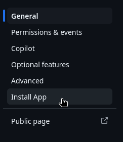
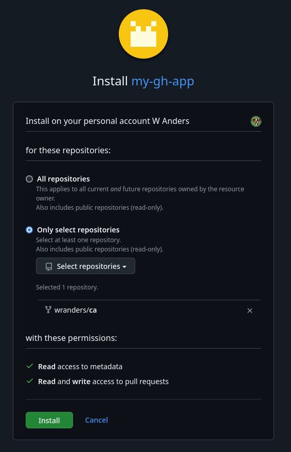

# Create Github App

In the very top-right corner of Github, click your profile image, then click
`Settings`.

In the column on the left, click `Developer settings` at the bottom.

You'll be brought to the `Github Apps` page that lists all of the Apps that
you've created.

Click `New Github App`.

## Basic Configuration

Create a name for your App. Also provide a `Homepage URL`. This is required, but
can point to anything.

Scroll down to the `Webhook` section and uncheck `Active`.

## Permissions

Scroll down to `Permissions`. Under `Repository permissions`:

Set `Contents` to `Read and write`:

Set `Metadata` to `Read-Only`:

Set `Pull requests` to `Read and write`:

## App Visiblility

Finally, you must choose where the App can be installed. If the CA repository is
owned by your personal account, then you can set the option
`Only on this account`.

However, if the repository is owned by an Organization acount, then this setting
***MUST*** be `Any account`, making the App public.

Now click `Create Github App`.

## Gather Facts and Generate Secrets

When the App is created, you'll need to take note of either the `App ID` or the
`Client ID`.

Either of these are used by the
[`ca-bootstrap`](https://github.com/doubleu-labs/ca-bootstrap){target="\_blank"}
toolkit to authenticate the App with the Github API.

Make sure to click the `Generate a new client secret` button to enable the app
to authenticate with the Github API.

Next, scroll down to the `Private Keys` section and click
`Generate a private key` button.

The Key will be created and the will automatically download. It will be probably
be located in your browser's default Downloads directory. Verify that it is as
you'll need it later for
[`ca-bootstrap`](https://github.com/doubleu-labs/ca-bootstrap){target="\_blank"}.

## Install App

Scroll to the top of the App settings page and click `Install App` in the menu
on the left.

Click the `Install` button next to the owner of the CA repository.

Then the Install page loads, select `Only select repositories`, then in the
drop-down list select the repository.

## Next

Your Github App is now installed to the repository owner's account and will be
able to access the CA repository.

Next, we [Bootstrap your CA.](../bootstrap.md)
